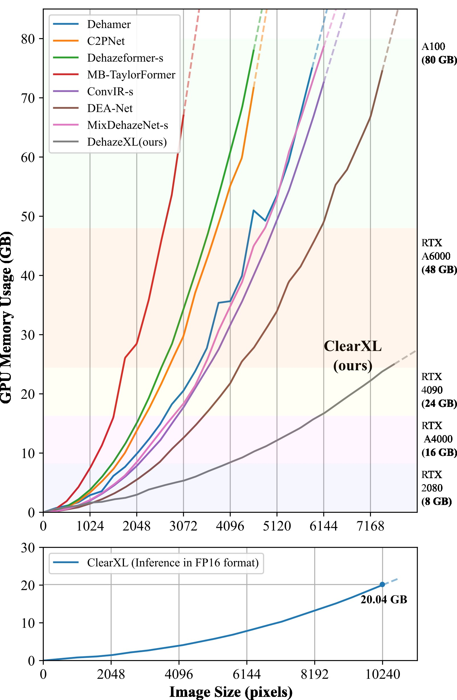

# ClearXL

Global Context Fusion for Efficient Haze and Cloud Removal in Ultra-High-Resolution Images 

## Features

:rocket: **Tailored for processing large-scale images without losing detail**

------

**:rainbow: A New Ultra-High-Resolution Dataset for Haze and Cloud Removal**

------

**:star: A Visual Attribution Method for Dehazing Tasks**

------

## Upcoming Release

We will soon release: 

- *Source Code*: The full implementation of ClearXL and Dehazing attribution method. 
- *Datasets*: The datasets used for training and evaluation. 
